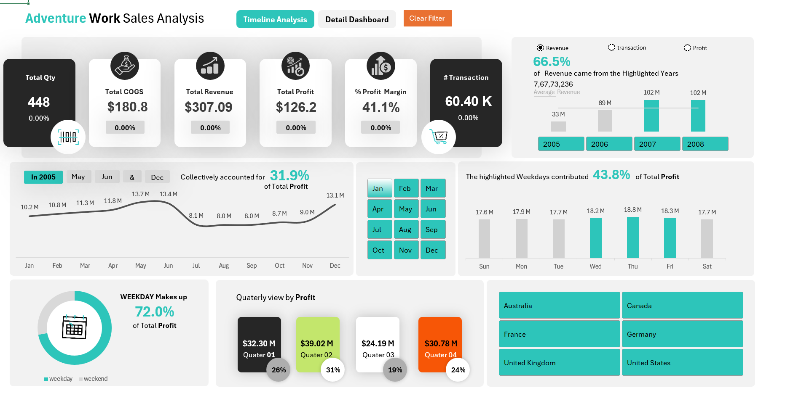
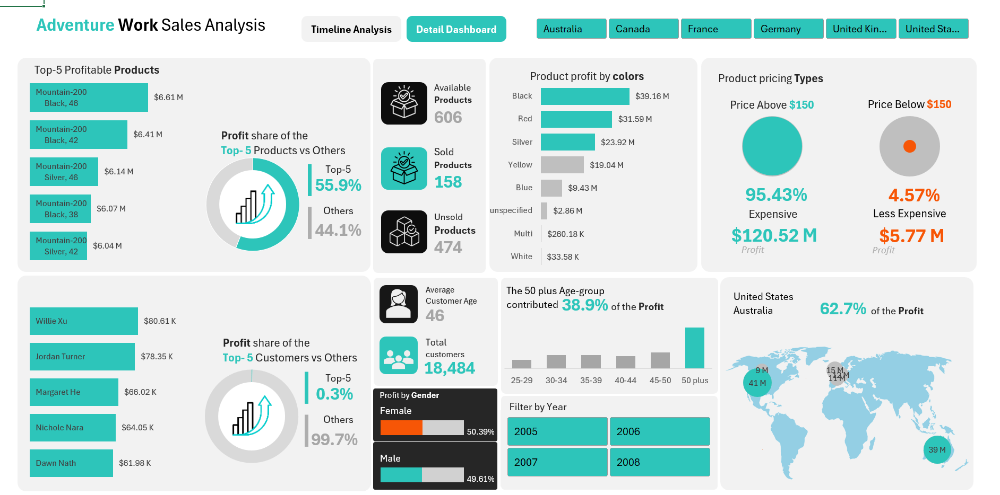

# Adventure Works – Excel Sales Analysis Dashboard

This project is an **Excel-based Business Intelligence (BI) dashboard** built on an **Internet Sales star-schema dataset (AdventureWorks)**.  
Although the sales are online, the products are **physical items**, so attributes like **Color, Category, Price, and Customer Demographics** are essential for business analysis.

---

## 1. Dataset & Data Model

**File:** `data/InternetSales_StarSchema.xlsx`

The dataset follows a **Star Schema** structure:

### Fact Table
- `FactInternetSales`
  - SalesAmount  
  - OrderQuantity  
  - TotalProductCost  
  - Profit  
  - ProductKey, CustomerKey, OrderDateKey  

### Dimension Tables
- `DimProduct` → Color, Category, Price  
- `DimCustomer` → Age, Gender, Income  
- `DimDate` → Year, Month, Quarter  
- `DimGeography` → Country, City  
- `DimSalesTerritory` → Region, Territory  

---

## 2. Dashboard File

**File:** `dashboard/Sales_Analysis_Dashboard.xlsb`  
Built using:
- Pivot Tables  
- Pivot Charts  
- Slicers  
- KPI Cards  
- Interactive Filters  

---

## 3. Dashboard Pages

### 1. Timeline & KPI Overview
- Total Quantity  
- Total COGS  
- Total Revenue  
- Total Profit  
- Profit Margin  
- Total Transactions  
- Year-wise (2005–2008) and Monthly Profit Trend  
- Weekday vs Weekend Profit  
- Quarterly Profit Comparison  
- Country-wise Profit Contribution  

---

### 2. Product Analysis
- Top 5 Most Profitable Products  
- Profit by Product **Color**  
- Sold vs Unsold Products  
- Price Segmentation:
  - Above $150 (Expensive)
  - Below $150 (Less Expensive)

**Color is used as a real product attribute to analyze customer preference, inventory planning, and profitability.**

---

### 3. Customer Analysis
- Top 5 Profitable Customers  
- Gender-wise Profit  
- Average Customer Age  
- Profit by Age Group  
- Profit by Country (Map View)

---

### 4. Detail Dashboard
- Transaction-level drill-down for detailed analysis and validation

---

## 4. Dashboard Preview

### Timeline & KPI Overview  


### Product & Customer Detail Dashboard  


---

## 5. Project Structure

```text
excel-sales-analysis-dashboard/
├─ data/
│  └─ InternetSales_StarSchema.xlsx
├─ dashboard/
│  └─ Sales_Analysis_Dashboard.xlsb
├─ docs/
│  └─ screenshots/
│     ├─ overview.png
│     └─ detail_dashboard.png
├─ README.md
└─ .gitignore
```
---

## 6. Tools & Technology

- Microsoft Excel  
- Star Schema Data Modeling  
- Pivot Tables & Pivot Charts  
- Slicers for Interactivity  
- KPI Card Design  
- Data Visualization  

---

## 7. Key Business Use-Cases

✅ Revenue & Profit Optimization  
✅ High-Performing Product Identification  
✅ Customer Behavior Analysis  
✅ Geographic Sales Insights  
✅ Pricing Strategy Evaluation  
✅ Inventory Planning via Color & Category Analysis  

---

## 8. Industry Relevance

This project demonstrates:
- End-to-end Excel-based BI workflow  
- Real-world e-commerce sales analysis  
- Decision-making using product, customer, time, and geography dimensions  
- Strong alignment with **Data Analyst / Business Analyst roles**
## 9. License

This project is shared for educational and portfolio purposes.

## 10. How to Clone This Repository
git clone https://github.com/Himanchal-Mishra/excel-sales-analysis-dashboard.git
